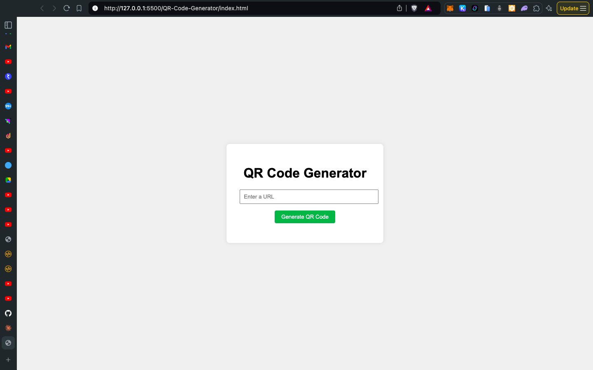

# QR Code Generator

This is a simple web application that generates QR codes from user-provided URLs. It's built using HTML, CSS, and JavaScript, making it easy to use and deploy.



## Features

- User-friendly interface
- Real-time QR code generation
- Responsive design for various screen sizes
- Input validation to ensure a URL is provided

## Technologies Used

- HTML5
- CSS3
- JavaScript
- [QRCode.js](https://davidshimjs.github.io/qrcodejs/) library for QR code generation

## Setup

1. Clone this repository or download the source files:
   - `index.html`
   - `style.css`
   - `script.js`

2. Open `index.html` in a web browser.

That's it! No additional setup or server is required as this is a client-side application.

## Usage

1. Open the application in a web browser.
2. Enter a URL into the input field.
3. Click the "Generate QR Code" button.
4. The QR code will appear below the button.

## Customization

You can easily customize the appearance of the application by modifying the `style.css` file. Some areas you might want to change include:

- Color scheme
- Font styles
- Layout and spacing

To modify the QR code generation options, you can adjust the parameters in the `script.js` file:

```javascript
new QRCode(qrcodeContainer, {
    text: url,
    width: 128,
    height: 128
    // Add more options here
});
```

Refer to the [QRCode.js documentation](https://davidshimjs.github.io/qrcodejs/) for more configuration options.

## Future Enhancements

Here are some ideas for future improvements:

- Add ability to download the generated QR code as an image
- Implement options for customizing QR code colors
- Add support for generating QR codes from other types of data (e.g., plain text, contact information)
- Implement error handling for network issues or invalid URLs

## Contributing

Contributions to improve the QR Code Generator are welcome. Please feel free to submit a Pull Request.

## License

This project is open source and available under the [MIT License](LICENSE).